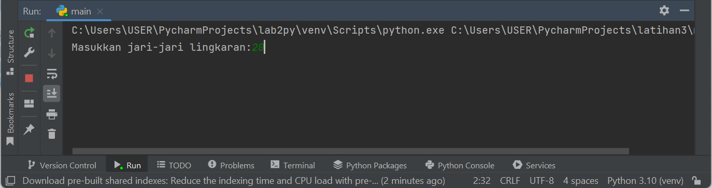

**Nama    :   Ghufron Malik**

**NIM     :   312210559**

**Kelas   :   TI.22.B2**

# Menggunakan fungsi input untuk mengambil nilai variabel dari keyboard.

# Menggunakan Python

## 1. Dwonload Python

Pastikan anda sudah mendwonload Python terlebih dahulu

> *https://www.python.org/downloads/windows/* 

## 2. Input Nilai dan Variabel

Bila sudah, buka IDLE dan masukan variabel sesuai project yang anda buat

## 3. Save

Save project dengan cara klik menu file atau Ctrl+S dan masukan *nama file* 

Setelah itu RUN, lalu anda akan di arahkan menuju IDLE Shell

## 4. Output Hasil

Terakhir masukkan nilai, maka hasil akan keluar secara otomatis

# Menggunakan PyCharm

## 1. Membuat Project Baru

Sebelumnya pastikan anda sudah mendwonload **PyCharm**. Bilas sudah, buat project baru pada tampilan awal.

## 2. Membuat Direktori

Masukkan nama project dan pilih lokasi penyimpanan untuk direktori anda

## 3. Membuat File

lalu klik kanan pada direktori kerja yang anda buat sebelumnya, pilih *New* lalu *Python File*

## 4. Input Nilai dan Variabel

input nilai dan variabel sesuai project anda lalu jalankan dengan cara klik tombol *RUN*

## 5. Output

Masukkan nilai

Maka hasil akan keluar secara otomatis

# SELESAI :)